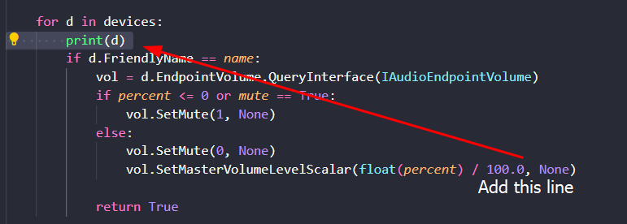

# Setup for the python librarys

1. `pip install pip-tools`

2. `pip-compile requirements.in`

3. `pip install -r requirements.txt`

---

# Microphone Setup
1. Add `print(d)` under the **for loop** in the **set_volume function**:

2. Then run the **main.py** and look in the **terminal**:

3. Copy the **exact microphone name** and paste it in the **MIC_NAME** variable in **main.py**

---

# OBS Setup
1. Find your **computer's IP address**

2. Change the **host** parameter in the **slider_to_db** function within **obs_volume.py**

3. Find your **OBS WebSocket password** and change the **password parameter** in the **same function**

4. Change the **SOURCE_NAME** variable in **main.py** to match your *OBS audio source name exactly (case-sensitive)*

---

# Usage
Run the application:

`python main.py`

**Make sure to keep it running in the background**